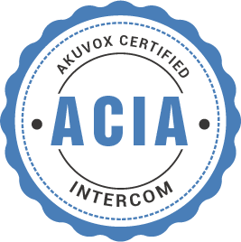
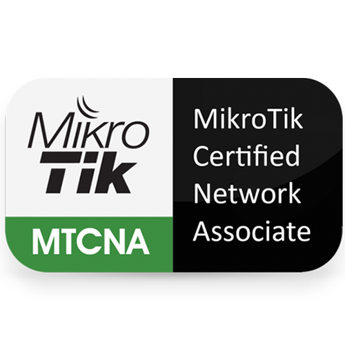
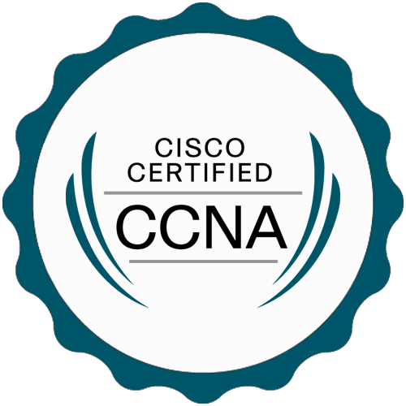
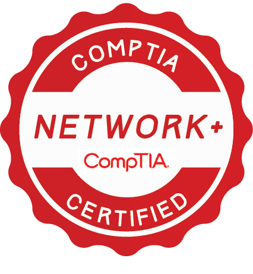

# 👨‍💻 Hi, I'm a Computer Engineering Student

🎓 Computer Engineering Student at Islamic Azad University, Tehran North Branch  
💡 Interested in Networking, Systems, and Web Development  
🚀 Always learning and improving my technical skills  

---

## 🛠 Skills

- MikroTik Networking
- Cisco Networking
- UniFi Systems
- Windows Administration

---

## 🎓 Education

🏫 Islamic Azad University, Tehran North Branch  
Major: Computer Engineering

---

## 📜 Certifications

  
  
  
  
  
  

---

## 📫 Contact

📧 Email: your-email@example.com  
📱 Telegram: @yourusername  
